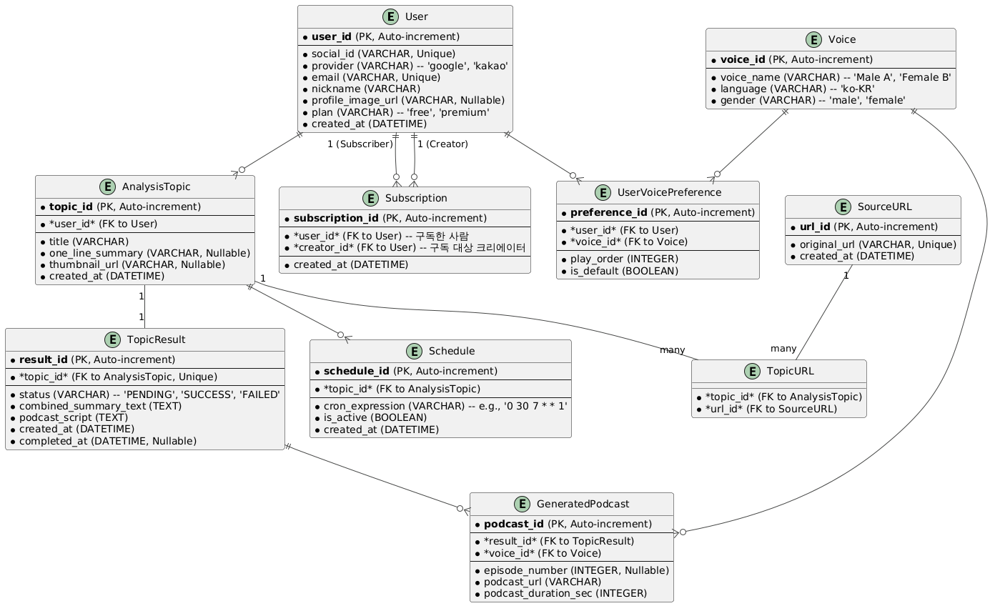

# AI Podcast Generator (가제)

URL 묶음을 입력하면 AI가 종합 분석하여 요약 리포트와 오디오 팟캐스트를 생성해주는 백엔드 서버입니다.

## 주요 기능 (Features)
- **주제별 분석**: 여러 개의 URL을 하나의 '분석 주제'로 묶어 종합적인 리포트를 생성합니다.
- **AI 리포트 생성**: Perplexity API로 소스 URL의 정보를 취합하고, Google Gemini API를 통해 고품질의 요약 리포트를 생성합니다.
- **AI 팟캐스트 변환**: 생성된 리포트 대본을 Naver CLOVA Voice API를 사용하여 자연스러운 음성의 팟캐스트로 변환합니다.
- **자동화 및 스케줄링**: Airflow를 이용해 전체 분석 파이프라인을 안정적으로 관리하고, 특정 시간에 자동으로 분석을 실행하도록 예약할 수 있습니다.
- **사용자 맞춤 설정**: 사용자별로 선호하는 팟캐스트 음성 및 재생 순서를 설정할 수 있습니다.

## 기술 스택 (Tech Stack)
- **Framework**: FastAPI
- **Database**: PostgreSQL
- **AI Pipeline**: LangGraph, Perplexity API, Google Gemini API, Naver CLOVA Voice API
- **ORM**: SQLAlchemy (Asynchronous)

## DB 세팅 (DB Setup)
1.  **[PostgreSQL](https://www.postgresql.org/download/) 설치**: 로컬 환경에 PostgreSQL 데이터베이스를 설치합니다.
2.  **데이터베이스 생성**: pgAdmin 또는 DBeaver와 같은 DB 관리 도구를 사용하여 프로젝트에서 사용할 데이터베이스(예: `my_project_db`)를 생성합니다.
3.  **DB 연결 정보 수정**: `app/database/database.py` 파일의 `DATABASE_URL` 변수를 자신의 DB 환경에 맞게 수정합니다.

## 실행 (Execution)

1.  **가상환경 활성화**
    ```bash
    conda activate capstone
    ```

2.  **프로젝트 루트 디렉토리로 이동**
    ```bash
    cd Back/
    ```

3.  **FastAPI 서버 실행**
    ```bash
    uvicorn app.main:app --reload
    ```
4.  **API 문서 확인**: 서버 실행 후, 웹 브라우저에서 `http://127.0.0.1:8000/docs` 로 접속하여 자동 생성된 API 문서를 확인하고 테스트할 수 있습니다.

## Docker Compose를 이용한 실행 (Docker Execution)

Docker Compose를 사용하면 데이터베이스와 백엔드 서버를 한 번에 실행할 수 있습니다.

1.  **환경 변수 설정**
    ```bash
    cp env.example .env
    # .env 파일을 열어서 다음 정보들을 설정하세요:
    # - POSTGRES_PASSWORD: 데이터베이스 비밀번호
    # - SECRET_KEY: JWT 토큰 암호화 키
    # - API 키들: Perplexity, Google, Naver CLOVA API 키
    ```

2.  **Docker Compose로 서비스 실행**
    ```bash
    docker-compose up -d
    ```

3.  **서비스 상태 확인**
    ```bash
    docker-compose ps
    ```

4.  **로그 확인**
    ```bash
    # 모든 서비스 로그
    docker-compose logs
    
    # 특정 서비스 로그
    docker-compose logs backend
    docker-compose logs postgres
    ```

5.  **서비스 중지**
    ```bash
    docker-compose down
    ```

6.  **데이터까지 완전 삭제**
    ```bash
    docker-compose down -v
    ```

### Docker Compose 서비스 구성
- **postgres**: PostgreSQL 17 데이터베이스 (포트: 5432)
- **backend**: FastAPI 백엔드 서버 (포트: 8000)
- **redis**: Redis 캐시 서버 (포트: 6379)

### 보안 주의사항
- `.env` 파일은 절대 Git에 커밋하지 마세요 (`.gitignore`에 포함됨)
- 프로덕션 환경에서는 반드시 강력한 비밀번호와 API 키를 사용하세요
- `env.example` 파일을 참고하여 필요한 환경 변수를 설정하세요

## 데이터베이스 스키마 (Database Schema)



### 주요 엔티티 (Entities)
- **User**: 사용자 정보 (소셜 로그인, 구독 플랜 등)
- **AnalysisTopic**: 사용자가 생성하는 '분석 주제' (여러 URL의 묶음)
- **SourceURL**: 분석에 사용될 개별 소스 URL의 원본 목록 (캐싱용)
- **TopicURL**: `AnalysisTopic`과 `SourceURL`의 다대다 관계를 연결
- **TopicResult**: `AnalysisTopic` 하나에 대한 단 하나의 종합 분석 결과 (요약문, 대본)
- **GeneratedPodcast**: `TopicResult`로부터 생성된 여러 목소리 버전의 팟캐스트 파일
- **Voice**: TTS에 사용될 음성 옵션 목록
- **UserVoicePreference**: 사용자별 팟캐스트 음성 선호도 및 재생 순서
- **Subscription**: 사용자 간의 구독 관계
- **Schedule**: 특정 `AnalysisTopic`의 자동 분석을 위한 스케줄 정보