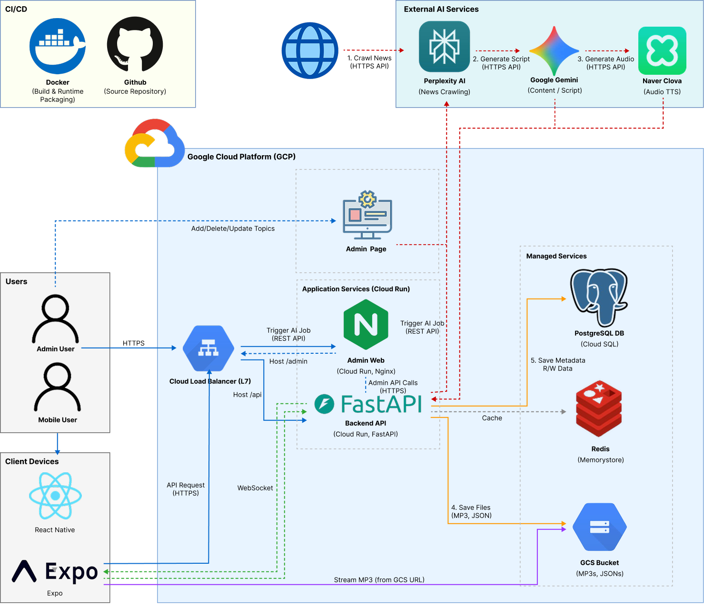
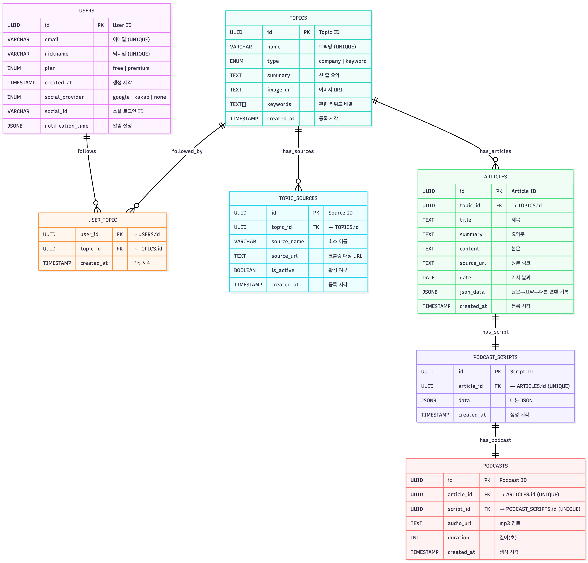

# 🎙️ SnackCast : 넘쳐나는 AI 소식, 한 입에 쏙

<!-- PROJECT LOGO -->
 

    
  </a>

  <h3 align="center">SnackCast</h3>
    <table width="100%">
    <tr>
        <td width="50%" align="center">
        <a href="https://www.canva.com/design/DAG5yPiyQ3c/wxNM3e20RRpy5fEln2sUAg/edit?utm_content=DAG5yPiyQ3c&utm_campaign=designshare&utm_medium=link2&utm_source=sharebutton">
            📑 Presentation (발표자료)
        </a>
        </td>
        <td width="50%" align="center">
        <a href="https://drive.google.com/file/d/1A4rJ98v5IshSCUr57mK5RXdPsSh6hp7M/view?usp=drive_link">
            📺 동영상 (시연영상)
        </a>
        </td>
    </tr>
    </table>

<table width="100%">
  <tr>
    <td bgcolor="#e3f2fd" align="center" style="padding: 10px;">
      

         
        <b>🎙️ EchoMind</b> 팀이 개발한, 
        출퇴근길에 듣기 좋은 <b>2인 대화형 팟캐스트 플랫폼</b>입니다.
          
      

    </td>
  </tr>
</table>

---

## 📝 프로젝트 개요

- **프로젝트명**: SnackCast  
- **팀명**: EchoMind
- **주제**: 출퇴근길에 듣기 편한 오디오 콘텐츠(팟캐스트)  
- **핵심 기술**: LangGraph Orchestration, RAG, TTS, FastAPI, React Native, Scalable Architecture
  
본 프로젝트는 빠르게 쏟아지는 AI 관련 정보를 개인 맞춤형으로 요약·제공하는 AI 기반 정보 큐레이션 서비스를 개발하는 것을 목표로 합니다. 사용자가 선택한 기업이나 카테고리에 맞춰 뉴스·블로그·공식 자료 등을 자동으로 수집하고, 이를 인공지능을 활용하여 간결하게 요약합니다. 이후 텍스트는 TTS를 통해 팟캐스트 형태의 오디오로 변환되며, 이해가 필요한 수치나 통계는 인포그래픽과 차트로 시각화됩니다. 최종적으로 이러한 결과물은 모바일 앱을 통해 개인화된 피드로 제공되어, 사용자가 언제 어디서든 효율적으로 정보를 습득할 수 있도록 지원합니다.

## 🔰 팀 구성 및 역할
|        | name | job |
|--------|------|-----|
| leader | 손준표 |  프로젝트 관리, GUI 설계, Front 개발 |   
| worker | 신재현 |  데이터 전처리, 커스텀 AI 모델 개발 |   
| worker | 이재욱 |  Front 개발, DB 구축 및 통신 프로토콜 설계 |    
| worker | 채희준 |  문서 작성, 디자인 |  

## 🛠 기술 스택 (Tech Stack)

### 📱 Frontend (Mobile App)

### 🖥️ Backend (Server & DB)

### 🧠 AI & Pipeline

### ⚙️ DevOps & Tools

[📱 프론트엔드(App) 상세 문서 보러가기](./Front/front/README.md)

[🛠️ 백엔드(Back) 상세 문서 보러가기](./Back/README.md)

[🤖 AI 엔진 상세 문서 보러가기](./AI/README.md)

## 🧩 시스템 구성

## 🖼 시스템 아키텍처

## ERD

 

## 주요 기능
- **정보 수집 자동화**: 시스템이 매일 정해진 시간에 자동으로 최신 기술 
트렌드와 뉴스를 수집하는 기능
- **맞춤형 설명 정보 제공**: 사용자가 구독한 키워드, 연관된 콘텐츠 선별하고 난이도 설정에 따라 개인화된 요약된 기사를 제공
- **팟캐스트 요약 정리**: 텍스트로 된 기사를 AI가 분석하여 핵심만 요약하고, 이를  '오디오 팟캐스트'로 변환하여 제공하는 기능

<table>
  <tr>
    <td width="50%" valign="top">
      <h3> 제공자 </h3>
      <ul>
        <li><b>정보 수집 자동화</b>: 시스템이 매일 정해진 시간에 자동으로 최신 기술 
트렌드와 뉴스를 수집하는 기능</li>
        <li><b>맞춤형 설명 정보 제공</b>: 사용자가 구독한 키워드, 연관된 콘텐츠 선별하고 난이도 설정에 따라 개인화된 요약 기사 제공 </li>
        <li><b>팟캐스트 요약 정리</b>: 텍스트로 된 기사를 AI가 분석하여 핵심만 요약하고, 이를  '오디오 팟캐스트'로 변환하여 제공</li>
      </ul>
    </td>
    <td width="50%" valign="top">
      <h3>소비자</h3>
      <ul>
        <li><b>키워드 구독</b>: 사용자가 자신의 관심사에 맞는 특정 기업이나 기술 키워드를 선택하여 구독하는 기능</li>
        <li><b>아카이브</b>: AI 팟캐스트 콘텐츠를 사용자가 저장·관리하여 이전 에피소드를 다시 듣거나 저장하는 기능</li>
        <li><b>자동 제작 설정</b>: 사용자가 원하는 시간에 팟케스트를 제공받을 수 있는 기능</li>
      </ul>
    </td>
  </tr>
</table>
